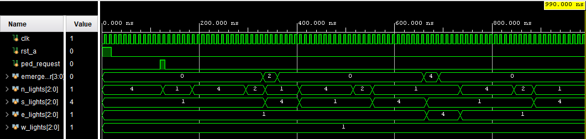
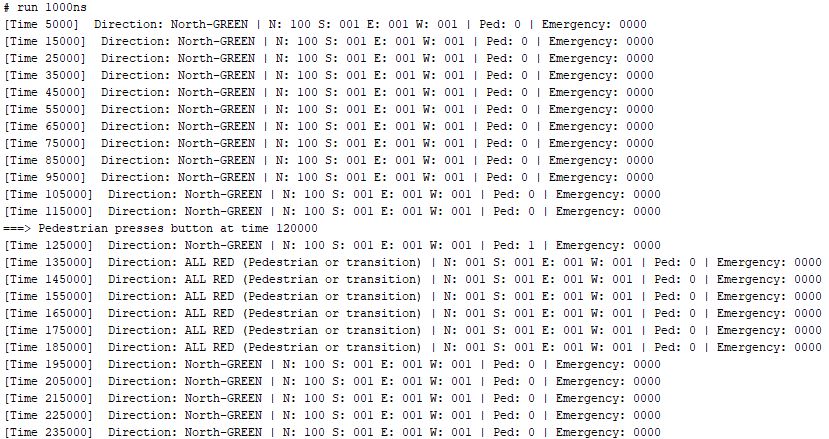
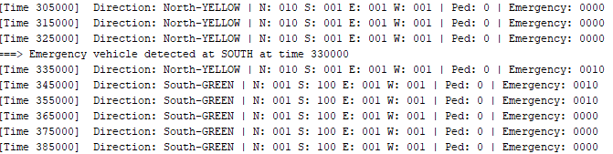

# Smart Traffic Light Controller (FSM-Based)

A 4-way smart traffic light controller designed using a Moore FSM in SystemVerilog. It includes:

- 🚦 Timed Green/Yellow/Red logic for N-S-E-W directions  
- 🚶‍♂️ Pedestrian override: All RED on request  
- 🚑 Emergency vehicle priority: Immediate green to incoming direction  
- ✅ Synthesizable, testbench-verified, and easy to extend for FPGA

## 🧠 FSM States

| State            | Meaning             |
|------------------|---------------------|
| N_GREEN, N_YELLOW | North traffic       |
| S_GREEN, S_YELLOW | South traffic       |
| E_GREEN, E_YELLOW | East traffic        |
| W_GREEN, W_YELLOW | West traffic        |
| ALL_RED_PEDESTRIAN | Pedestrian cross   |
| *_EMERGENCY       | Emergency handling  |

## 📂 Files

| File                  | Description                      |
|-----------------------|----------------------------------|
| `traffic_control.sv`  | RTL design (FSM)                 |
| `tb_traffic_control.sv`| Testbench with waveform & print |
| `docs/`               | Block diagrams, explanations     |

## 📸 Simulation Outputs

### 🧠 FSM Waveform
Shows the FSM behavior across time with transitions between green/yellow/red lights:
Perfect! Here's the **same waveform explanation wrapped in a collapsible section** for your `README.md` on GitHub:

---

### 📸 Simulation Outputs

📊 <strong>FSM Waveform Explanation</strong> (Click to expand)

 

### 🖼️ **FSM Waveform Overview**

This waveform illustrates the behavior of the **4-way Smart Traffic Light Controller** over a span of 0 to 990 ns.

---

### 🔄 **Signal Descriptions**

| Signal               | Description                                     |
| -------------------- | ----------------------------------------------- |
| `clk`                | System clock (10ns period)                      |
| `rst_a`              | Active-high reset signal                        |
| `ped_request`        | High when pedestrian presses the request button |
| `emergency_dir[3:0]` | Emergency request from direction (N, S, E, W)   |
| `n_lights[2:0]`      | North signal: 1 = RED, 2 = YELLOW, 4 = GREEN    |
| `s_lights[2:0]`      | South traffic light output                      |
| `e_lights[2:0]`      | East traffic light output                       |
| `w_lights[2:0]`      | West traffic light output                       |

---

### 🕒 **Key Events in the Waveform**

#### 🔹 0 ns to 100 ns: **System Reset**

* `rst_a` is HIGH → All signals are reset.
* Traffic lights initialize to default (North gets green).

---

#### 🔹 \~120 ns: **Pedestrian Request**

* `ped_request` goes HIGH → System transitions to **All RED** (`1`) on all sides.
* Seen as all four `*_lights` go to `001` simultaneously (RED).
* This ensures safe pedestrian crossing for a fixed period (e.g., 5 cycles).

---

#### 🔹 After Pedestrian Phase (\~200 ns onward): **Normal Traffic Cycle Resumes**

* The system continues its predefined FSM cycle:

  1. North → Green → Yellow
  2. South → Green → Yellow
  3. East → Green → Yellow
  4. West → Green → Yellow
* Transitions are visible as:

  * Green (`4`) → Yellow (`2`) → Red (`1`), one direction at a time.

---

#### 🔹 \~360 ns: **Emergency Vehicle Detected**

* `emergency_dir` briefly shows `2` (South emergency).
* FSM gives **South immediate green** (`s_lights = 4`).
* After fixed emergency time, FSM resumes normal cycle.

---

### ✅ Summary

* The waveform clearly shows:

  * FSM responding to pedestrian and emergency events.
  * One direction is active at a time (no conflicts).
  * Transitions are controlled by internal timers.

---

### 📌 Pro Tip for Viewers:

To match values:

* **4 → GREEN**
* **2 → YELLOW**
* **1 → RED**
* Emergency triggers are visible on `emergency_dir`.
* Pedestrian logic is visible through `ped_request`.

---

---

### 🚶 Pedestrian Override Output

Console output when pedestrian request is triggered:

---

### 🚑 Emergency Vehicle Priority Output

Console debug output when an emergency vehicle is detected:

